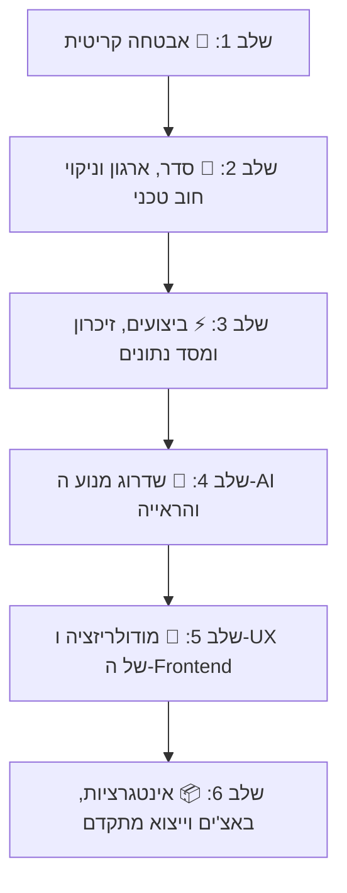

# MockupGen — תוכנית שיפור, שדרוג ואבטחה מקיפה
**תאריך יצירה:** 2026-08-21  
**מצב נוכחי:** Flask 3.0 + Pillow/NumPy + SQLite + Google Vertex AI (Gemini)  
**סטטוס בדיקות:** 208/208 טסטים עוברים בהצלחה + `ruff check` נקי  
**עדכון אחרון:** 2026-08-30 — שלב 1 הושלם במלואו; P3.3, P3.4 ו-P6.4 הושלמו  

---

## 📋 מבנה תוכנית העבודה

התוכנית מחולקת ל-6 שלבים לפי סדר עדיפות הגיוני.  
**כל שלב מכיל סעיפים מוגדרים.** לפני ביצוע של כל סעיף, תינתן אפשרות לאשר, לדלג או להתאים אותו.

---

## שלב 1: 🔴 אבטחה קריטית (חובה לפני חשיפה לרשת)

| מזהה | סטטוס | נושא | מה בוצע בפועל |
| :--- | :--- | :--- | :--- |
| **P1.1** | ✅ **הושלם** | **אבטחת נקודות קצה Telemetry** | `@require_admin_json` על חמשת נתיבי `/api/telemetry/*`, ו-`@require_csrf` נוסף על `purge-temp` ו-`clear-logs`. גם דף `/server-pulse` עצמו מפנה ללוגין למי שאינו מזוהה, ו-`server_pulse.js` שולח את ה-CSRF בשתי הבקשות ההרסניות. אומת בדפדפן: אנונימי מקבל 401/302, מחובר מקבל 200. |
| **P1.2** | ✅ **הושלם** | **חסימת Path Traversal ב-Asset Serving** | `published_asset_path()` ב-`admin_routes.py`: גם ה-id וגם שם הקובץ חייבים להיות מקטע נתיב יחיד, והקובץ אחרי `resolve()` חייב לשבת בתוך תיקיית התבנית שבתוך `TEMPLATES_FOLDER`. הבדיקה תפסה חור בגרסה הראשונה של התיקון (`template_id = ".."` עבר, כי `Path("..").name == ".."`). |
| **P1.3** | ✅ **הושלם** | **הגבלת גודל העלאה ואבטחת סביבה** | `DEFAULT_MAX_CONTENT_LENGTH = 32MB` כברירת מחדל (משתנה סביבה גובר; `0` מבטל את התקרה); `create_app` מסרב לעלות עם `SECRET_KEY` הדיפולטי מחוץ ל-debug/testing; ו-Rate Limiting ללוגין — 10 ניסיונות לכתובת בחלון של 5 דקות, מתאפס בכניסה מוצלחת. | **עודכן 31.08.2026:** התקרה של 32MB חסמה ייבוא של 20 מוקאפים — נמדד שעשרים מהמוקאפים של הקטלוג שוקלים 40MB בממוצע ו-72.9MB במקרה הגרוע. התקרה הזו נועדה ל-API הציבורי, ולכן נתיבי האדמין שמעלים קבצים מרימים אותה לעצמם בלבד דרך `ADMIN_MAX_CONTENT_LENGTH` (512MB כברירת מחדל, per-request). אומת: ייבוא של 72.9MB עובר ב-20.5 שניות, ובקשה ציבורית של 41MB עדיין נדחית ב-413 עם הודעה שאומרת כמה נשלח, מה התקרה, ואיזה משתנה משנה אותה.
| **P1.4** | ✅ **הושלם** | **תיקון XSS בהזרקת Attributes ב-JS** | שבעה מקומות הועברו מ-`escapeHtml` ל-`escapeAttr` (`escapeHtml` אינו בורח מגרשיים, ולכן שם תבנית עם `"` יוצא מה-attribute). בדיקה סורקת את כל הקובץ ונכשלת אם מישהו יחזיר `escapeHtml` לתוך attribute. |

---

## שלב 2: 🧹 סדר, ארגון המאגר וניקוי חוב טכני

| מזהה | סטטוס | נושא | פירוט טכני | השפעה וסיכון |
| :--- | :--- | :--- | :--- | :--- |
| **P2.1** | 🔒 **נשמר לבקשת המשתמש** | **מחיקת Dead Code ב-`simple_mockup_service.py`** | הבלוק אחרי `return composed` (שורות 657–725) נשמר במלואו בקובץ. | שמירה על קוד קיים. |
| **P2.2** | ✅ **הושלם** | **ארגון סקריפטים ניסיוניים מתיקיית השורש** | העברת 15+ סקריפטים עצמאיים (`etsy_frame_resizer_v*.py`, `edgefinder*.py`, וכו') לתיקיית `archive/experiments/`. | מאגר שורש נקי ומקצועי המכיל רק קבצי ליבה. |
| **P2.3** | ✅ **הושלם** | **העברת משקלי מודלים כבדים מ-Git** | העברת `sam2.1_l.pt` (449MB) ו-`RealESRGAN_x4plus.pth` (67MB) לתיקיית `models/` והחרגתם ב-`.gitignore`. | מניעת התנפחות בלתי רצויה של מאגר ה-Git והאטת שיבוטים (clones). |
| **P2.4** | ✅ **הושלם** | **הגדרת קובץ `pytest.ini`** | יצירת `pytest.ini` המגדיר `testpaths = tests` כדי למנוע מ-pytest לאסוף קבצי ניסוי שבורים ב-`scratch/`. | הרצת בדיקות מהירה, חלקה ונקייה בפקודה אחת פשוטה. |
| **P2.5** | ✅ **הושלם** | **איחוד כפילויות לוגיות ב-Backend** | `services/template_manifest.py` — בונה יחיד ל-`manifest.json` (18 שדות שנכתבו בשני קבצים ושכבר הספיקו לסטות: fallback חסר בצד אחד, שם קובץ קשיח בצד השני). `routes/responses.py` — `json_error` אחד לשני ה-blueprints במקום שתי איות לאותו חוזה. ציור מסכות מפוליגון כבר היה מאוחד ב-`mask_from_regions`. | מניעת באגים הנובעים מסטיות במימושים מקבילים. |

---

## שלב 3: ⚡ ביצועים, זיכרון ומסד נתונים

| מזהה | סטטוס | נושא | פירוט טכני | השפעה וסיכון |
| :--- | :--- | :--- | :--- | :--- |
| **P3.1** | ✅ **הושלם** | **הפעלת SQLite WAL Mode ו-Busy Timeout** | הוספת `PRAGMA journal_mode=WAL;` ו-`PRAGMA busy_timeout=5000;` ב-`CatalogService` וסגירה מפורשת של Connections. | מניעת שגיאות `database is locked` תחת עבודה מרובת נימים (Waitress Multi-threads). |
| **P3.2** | ✅ **הושלם** | **Caching למודל SAM 2** | טעינת מופע יחיד של מודל ה-SAM בזיכרון (Lazy Singleton) ב-`classic_detection_service.py` במקום טעינה מהדיסק בכל קריאה. | קיצור זמן זיהוי מסגרת בעזרת SAM משניות ארוכות לפחות משנייה. |
| **P3.3** | ✅ **הושלם** | **צמצום תפיסת הזיכרון ב-Green Detection Cache** | `green_alpha_mask` נמחק (נכתב ומעולם לא נקרא), ושלוש מסכות ה-bool נשמרות כביטים (`np.packbits`) ונפרשות בקריאה. נמדד על H1-2 (1254×1254): **17.30MB → 6.88MB לכל ערך**, קאש מלא של 12: **208MB → 83MB**, ובקנבס 6000×6000: **4.75GB → 1.89GB**. פריסה עולה 0.8ms לגישה. חסר אובדן מידע: `packbits` הוא הלוך-ושוב מדויק, ובדיקה נועלת את זה. | חיסכון של 60% מה-RAM של הקאש, בלי שינוי של פיקסל אחד בתוצאה. |
| **P3.4** | ✅ **הושלם** | **ThreadPoolExecutor גלובלי משותף** | Pool יחיד נוצר ב-`create_app` (`app.extensions["detection_pool"]`, גודלו לפי `DETECTION_MAX_WORKERS`, ברירת מחדל 5), ו-`batch-detect` משתמש בו. באצ' שני ממתין בתור במקום להכפיל threads וקריאות ספק. Threads נוצרים לפי דרישה, כך שאפליקציה שלא מזהה דבר לא משלמת על כך. | תקרה אמיתית על מקביליות הזיהוי — מכסת Vertex AI נספרת לפי פרויקט, לא לפי בקשה. |
| **P3.5** | ✅ **הושלם** | **מניעת N+1 Queries ברשימת תבניות** | שליפה מרוכזת (Bulk Query) של נתוני התבניות מ-SQLite ב-`mockup_routes.py:75` במקום שאילתה נפרדת לכל תבנית. | האצה של פי 5 עד 10 בזמן התגובה של טעינת רשימת התבניות. |
| **P3.6** | ✅ **הושלם** | **הסרת Deprecation Warnings של Pillow 13** | עדכון כל קריאות `Image.fromarray(..., mode="...")` כדי למנוע שבירה בעדכון Pillow עתידי. | שמירה על תאימות מלאה לספריות עדכניות ללא אזהרות ריצה. |

---

## שלב 4: 🤖 שדרוג מנוע ה-AI והראייה הממוחשבת

| מזהה | סטטוס | נושא | פירוט טכני | השפעה וסיכון |
| :--- | :--- | :--- | :--- | :--- |
| **P4.1** | ✅ **בוצע בעבר** | **מעבר ל-Structured JSON Schema ב-Vertex AI (Gemini)** | קיים בקוד: `services/vertex_detection_service.py` כבר עובד עם `response_mime_type="application/json"` ו-`response_schema`. | 100% ודאות במבנה הנתונים המוחזר ללא כשלונות פענוח. |
| **P4.2** | ✅ **הושלם** | **שירות יצוא קבצי הדפסה (Print Export) — במקום אפסקיילר** | **הסעיף נוסח מחדש אחרי בדיקה (31.08.2026).** הניסוח הקודם — הטמעת `RealESRGAN_x4plus.pth` לחידוד יצירות לפני רינדור — נבדק ונמצא מיותר: כל 192 הפתחים בקטלוג צרים מ-928px, כלומר היצירה כמעט תמיד **מוקטנת** לתוך המסגרת, והמשתמש אישר שהמוקאפים חדים מספיק. מה שכן נדרש הוא הצד השני: **ייצור קבצי ההדפסה שהקונה מוריד**, שכבר עובד בקובץ `archive/experiments/etsy_frame_resizer_v3_safe_fit_no_crop.py` (safe-fit בלי חיתוך, סולם step/bicubic/unsharp, וטבלת גדלים כמו 2:3 → 7200×10800). **המבנה שסוכם:** דף משלו בכתובת נפרדת כמו `/server-pulse` — לא מסך בתוך הסטודיו — באותה אפליקציית Flask (אותו login, אותו deploy), עם **DB משלו** (`data/print_sizes.sqlite3`) והגדרות משלו בתוך אותו דף, כדי שהכלי יוכל להתפצל בעתיד לאפליקציה עצמאית. ה-API (`/api/print/...`) הוא הלקוח הראשי, כך ש-EtsyAutoLister מבקש קבצי הדפסה כמו שהוא מבקש מוקאפים. **הגדלים מוגדרים על ידי האדמין לפי יחס, כמו Listing Sets**: יצירה שמגיעה נמדדת, והיחס שלה מושך את סט הגדלים שהוגדר לו. רשימת היחסים מפסיקה להיות קבוע בקוד והופכת לנתון באפליקציה — ומדריכי הגדלים נתלים על אותה הגדרה, כך שיחס חדש מקבל גם גדלים וגם מדריך בלי הגדרה כפולה. **המוקאפים מרונדרים מהיצירה המקורית בלבד**, לא מהגדלים: כולם אותה תמונה בפיקסלים שונים, וכולם מוקטנים לאותו פתח — אז רינדור לכל גודל היה מייצר תוצאה זהה בייט-בבייט בפי N עבודה. **מגבלה שתסומן ב-API:** שני מצבי האיכות מבוססי-AI (Real-ESRGAN, Topaz) קוראים לקבצי הרצה חיצוניים ולכן יוצעו רק במכונה שבה הם מותקנים, כמו AVIF היום.  **בוצע (01.09.2026).** `services/print_export_service.py` נושא את סולם ההגדלה מהסקריפט של המשתמש (step / bicubic / unsharp / basic ושני מצבי AI), `services/print_catalog_service.py` מחזיק DB נפרד (`ratios`, `print_sets`, `settings`) עם ששת היחסים זרועים מהטבלה המקורית, ו-`routes/print_routes.py` מגיש את `/print` ואת `/api/print/ratios|sets|settings|export|archive` — קריאה פתוחה ללקוח, כתיבה באדמין+CSRF. המסך עצמו בשלוש עמודות (סטים / יצוא / יחסים), כל יחס מצויר כמלבן בפרופורציה האמיתית שלו, התוצאות למעלה וההעלאה למטה, לחיצה על תוצאה פותחת מסך מלא, ואיקון פח לכל סט עם הודעת אזהרה. הקבצים נשמרים JPEG 95 עם 300 DPI, וה-ZIP מסיר את מזהה האצווה מהשמות. אומת בדפדפן: יצירה 900×600 לרוחב הפיקה 3/3 קבצים מסובבים נכון בלי שגיאות קונסולה; 8 בדיקות ב-`tests/test_print_export.py`. | הקונה מקבל את קבצי ההדפסה מאותה העלאה שממנה נוצרו המוקאפים, בלי כלי נפרד. |
| **P4.3** | ⏳ בהמתנה | **תמיכה ב-Cylindrical / Mesh Warping (כוסות, ספלים, חולצות)** | הוספת אלגוריתם עיוות קמור/גלילי המאפשר הדבקת יצירות על משטחים מעוקלים. | הרחבת השימוש במוקאפים מעבר למסגרות קיר גם למוצרי Print-on-Demand מגוונים. |
| **P4.4** | ✅ **הושלם** | **יצירת מוקאפים ב-AI מתוך הסטודיו (Vertex AI · Nano Banana 2)** | מסך **Generate mockups**: שישה חדרים בלחיצה (סלון, חדר שינה, פינת אוכל, מסדרון, חדר עבודה, חדר ילדים), בחירת קטגוריה, מספר מסגרות (1–4), אוריינטציה ויחס; פרומפט שניתן לעריכה ונשמר, ותמונת דוגמה אופציונלית. **סעיף הירוק לא ניתן למחיקה**: גם נוסח שנכתב מחדש לגמרי מקבל את הדרישה לירוק כרומה אחיד לגמרי (0,255,0) בלי צל, השתקפות, מסגרת פנימית או גוון אחר בתמונה. **שום תמונה לא נשמרת על סמך הבטחה**: כל תוצר עובר את מנוע הזיהוי של הסטודיו עצמו ומדווח — כמה פתחים נמצאו, כמה אחיד הירוק בכל אחד, וכמה הוא רחוק מכרומה. תמונה שנכשלת לא נשמרת אלא מוצגת עם המספרים שלה ואפשר לשמור אותה בכל זאת. **הספים כוילו על פלט אמיתי** ולא על תמונות סינתטיות: יצירה נקייה מודדת ~15 (רעש הדחיסה של המודל), צל קל 19, בוהק זכוכית 25, צל ממשי 43 — ולכן מעל 22 נפסל, ובין 18 ל-22 מוצגת הערה. מה שנשמר הוא **טיוטת תבנית רגילה לגמרי** (background+preview באותו נתיב של ייבוא), כך שהזיהוי, העריכה והפרסום לא יודעים להבדיל. 6 בדיקות חדשות; אומת מקצה לקצה מול Vertex — חדר פוטוריאליסטי עם מסך ירוק נקי ב-15 שניות, שנשמר כטיוטה. | המשתמש כבר לא תלוי בייבוא מוקאפים מבחוץ — הוא מייצר קטלוג משלו מתוך הסטודיו. |

---

## שלב 5: 🎨 מודולריזציה ו-UX של ה-Frontend (Admin Studio)

| מזהה | נושא | פירוט טכני | השפעה וסיכון |
| :--- | :--- | :--- | :--- |
| **P5.1** | 🔄 **בתהליך** | **פיצול מודולרי של `admin.js`** | הפיצול נעשה מהעלים פנימה, שלב שנבדק בדפדפן בכל פעם. הדף טוען `admin.js` כ-ES module (ומכאן: strict mode, וטעינה אחרי בניית ה-DOM). הוצאו עד כה: `modules/helpers.js` (13 פונקציות טהורות), `modules/canvasRails.js` (מערכת הסרגלים הצפים — גרירה, עגינה, היפוך וזיכרון), `modules/sliders.js` (RESET וגלגלת לכל סליידר). `admin.js`: 8,028 → 7,438 שורות. הבאים בתור: `api.js`, `storage.js`, ואז הדומיינים הכבדים (קנבס, אפקטים, מודאל הבדיקות). | קוד נקי, תחזוקתי, קריא וקל להרחבה ללא התנגשויות. |
| **P5.2** | **איחוד בלוקי Apply-To-All ומערכת הדיאלוגים** | כיווץ 8 בלוקים כפולים של Apply-To-All לפונקציית Factory אחת (~40 שורות במקום ~350) ואיחוד שתי מערכות הדיאלוגים המקבילות. | חיסכון משמעותי בשורות קוד ומניעת חוסר עקביות ויזואלית. |
| **P5.3** | **שיפורי נגישות ו-UI Hygiene** | המרת פריטי ניווט `
` ל-`<button>`, הוספת `aria-pressed` ל-pills, focus trap בדיאלוגים, והעברת `inline style` לקלאסים של CSS. | ממשק נגיש, תקני, נוח למקלדת ומעוצב היטב. |

---

## שלב 6: 📦 אינטגרציות, באצ'ים וייצוא מתקדם

| מזהה | סטטוס | נושא | פירוט טכני | השפעה וסיכון |
| :--- | :--- | :--- | :--- | :--- |
| **P6.1** | ✅ **הושלם** | **תמיכה ב-WebP / AVIF והורדת ZIP** | AVIF נוסף — ורק היכן ש-Pillow המותקן באמת יודע לכתוב אותו (התמיכה הגיעה ב-11.3, והפרויקט תומך גם ב-10), כך שרשימת הפורמטים שהלקוח נדחה מולה היא הרשימה שבאמת עובדת. `POST /api/mockups/outputs/archive` מחזיר ZIP של רינדורים גמורים — **תוספת בלבד**, תשובת ה-JSON של ה-batch לא השתנתה כדי לא לשבור את EtsyAutoLister. בממשק: כפתור "Download all" בתוצאות Test mockups. בנוסף תוקן: פריט שגוי ב-batch כבר לא מפיל את כל הבקשה. | הקטנת גודל הקבצים ונוחות למשתמשי הקצה. |
| **P6.2** | ⏳ בהמתנה | **מערכת תורים אסינכרונית (Job Queue + Progress Bar)** | ניהול באצ'ים כבדים ברקע עם מזהה `job_id` ובדיקת סטטוס אסינכרונית. **נמדד ב-31.08.2026 ונדחה בינתיים:** רינדור אמיתי מול הקטלוג לוקח 0.6 שניות למוקאפ (1 מוקאפ 0.5 שנ׳, 5 מוקאפים 3.1 שנ׳, 10 מוקאפים 5.8 שנ׳), והתקרה בבאצ' היא 20 פריטים — כלומר כ-12 שניות מול timeout של 180 שניות בצד הלקוח (EtsyAutoLister). התור האסינכרוני פותר בעיה שאינה קיימת כרגע; כדאי לחזור אליו כשמוקאפים כבדים בהרבה או באצ'ים של מאות ייכנסו לתמונה. | רינדור חלק של עשרות מוקאפים ללא חשש מ-HTTP Timeout. |
| **P6.3** | ✅ **הושלם** | **חבילות ליסטינג אוטומטיות לחנויות (Etsy Listing Bundles)** | **מסך Listing sets**: סט הוא שלושה אזורים — תמונה ראשית אחת (רק מוקאפ MAIN), עד 18 מוקאפים, ומדריך גדלים; האזור שנבחר קובע מה הפקד מציע, ולכן כלל ה-MAIN נשמר מעצם המבנה ולא בבדיקה בדיעבד. הכלל נאכף גם בשרת: MAIN מחוץ ל-hero, או hero שאינו MAIN, נדחים ב-400. סוג המוצר הוא של החנות (Printable Wall Art, PNG Artwork Pack, Lightroom Presets, Digital Planners). 25 התבניות בקטגוריות MAIN שונו ל-`MAIN-…` והכלל נאכף אוטומטית. **מדריכי גדלים**: מאגר שהאדמין מעלה, מתויג ביחס שאומר גם את האוריינטציה (2:3 מול 3:2). לצדו יצירה ב-Vertex — חמישה סגנונות בלחיצה, פרומפט שניתן לעריכה ונשמר, תמונת דוגמה לכל סגנון, וסעיף דיוק-טקסט שמצורף לכל נוסח. **מגבלה ידועה שנבדקה**: המודל לא משמר יחסי גודל אמיתיים (מסגרות מול גובה אדם/ספה), ולכן המאגר תמיד קודם ל-AI בזמן רינדור, וההמלצה היא להעלות מדריכים ידנית. `POST /api/mockups/listing-bundle` מקבל `set`; ללא סט נבחרת תבנית MAIN ראשית ושתי תבניות שאינן MAIN אחריה. אגב כך תוקנו שני באגים: `.avif` שנשמר בפועל כ-JPEG, ודיאלוג אישור שנפתח מתחת לחלון שביקש אותו. | חיסכון של שעות עבודה ידניות בהכנת ליסטינגים, ושליטה מלאה במה שנכנס לכל ליסטינג. |
| **P6.4** | ✅ **הושלם** | **תשתיות CI/CD ו-Docker** | `Dockerfile` (python:3.12-slim, משתמש לא-root, healthcheck על `/api/health`), `docker-compose.yml` עם volumes לנתונים, ו-`.github/workflows/ci.yml` שמריץ ruff + 159 בדיקות + בונה את האימג' ומוודא שהוא עולה ועונה. `requirements.txt` תוקן (חסרו numpy ו-OpenCV שהקוד מייבא בראש הקובץ) ופוצל ל-dev ול-ml. `ruff.toml` מכוון לטעויות אמיתיות; 36 ממצאים תוקנו אוטומטית ו-13 ידנית. האימג' ירד מ-2.76GB ל-1.11GB אחרי שהנתונים הוצאו ממנו ושכבת ה-chown הכפולה בוטלה. | סביבת פיתוח אחידה, שער בדיקות אוטומטי, ומוכנות לפריסה. |

---

## 🎯 תהליך הביצוע המתוכנן

לפני כל שלב וסעיף:
1. **נציג את הסעיף המבוקש** ונאשר את ביצועו מולך.
2. **ניישם את השינויים** בצורה נקייה וממוקדת.
3. **נריץ את מערך הטסטים (208 בדיקות)** כדי לוודא שאין שום רגרסיה ושהכל עובד בצורה מושלמת.
4. **נסמן את הסעיף כהושלם (V)** ונעבור לסעיף הבא.
