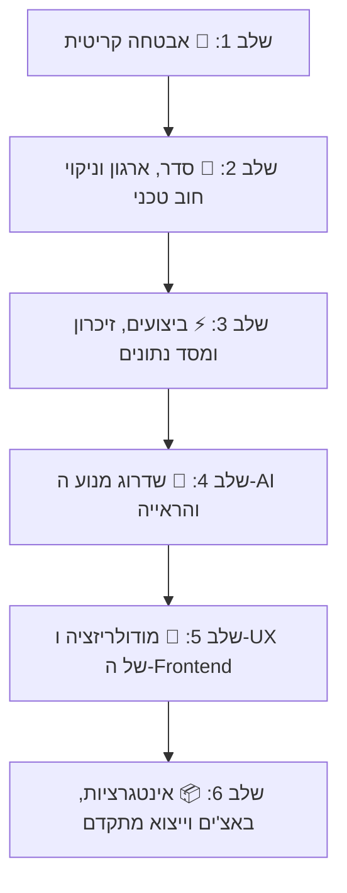

# MockupGen — תוכנית שיפור, שדרוג ואבטחה מקיפה
**תאריך יצירה:** 2026-08-21  
**מצב נוכחי:** Flask 3.0 + Pillow/NumPy + SQLite + Google Vertex AI (Gemini)  
**סטטוס בדיקות:** 92/92 טסטים עוברים בהצלחה  

---

## 📋 מבנה תוכנית העבודה

התוכנית מחולקת ל-6 שלבים לפי סדר עדיפות הגיוני.  
**כל שלב מכיל סעיפים מוגדרים.** לפני ביצוע של כל סעיף, תינתן אפשרות לאשר, לדלג או להתאים אותו.

---

## שלב 1: 🔴 אבטחה קריטית (חובה לפני חשיפה לרשת)

| מזהה | נושא | פירוט טכני | השפעה וסיכון |
| :--- | :--- | :--- | :--- |
| **P1.1** | **אבטחת נקודות קצה Telemetry** | הוספת `@require_admin_json` ו-`@require_csrf` לנתיבי `/api/telemetry/*` ב-`routes/admin_routes.py` (בפרט `purge-temp` ו-`clear-logs` שמאפשרים מחיקת קבצים ללא הזדהות). | מניעת מחיקת קבצים שרירותית ומניעת דליפת Stack Traces וכתובות IP. |
| **P1.2** | **חסימת Path Traversal ב-Asset Serving** | ב-`admin_routes.py:337` (`/api/admin/templates/<id>/asset/<name>`), הוספת בדיקת `active_asset.resolve()` ווידוא הכלה בתוך `TEMPLATES_FOLDER` (כמו `_safe_asset_path`). | מניעת קריאת קבצי מערכת רגישים (כגון `.env` ו-`SECRET_KEY`). |
| **P1.3** | **הגבלת גודל העלאה ואבטחת סביבה** | הגדרת `MAX_CONTENT_LENGTH = 32 * 1024 * 1024` (32MB) כברירת מחדל ב-`config.py`, חסימת עליית שרת עם `SECRET_KEY` דיפולטי בפרודקשן, והוספת Rate Limiting ללוגין. | מניעת התקפות DoS מבוססות העלאת תמונות ענק (OOM). |
| **P1.4** | **תיקון XSS בהזרקת Attributes ב-JS** | החלפת השימוש ב-`escapeHtml` ל-`escapeAttr` בכל מקום שבו שמות תבניות מוזרקים לתוך `title="${...}"`, `aria-label="${...}"`, `alt="${...}"` ב-`admin.js`. | מניעת שבירת HTML והזרקת סקריפטים זדוניים בשמות מוקאפים. |

---

## שלב 2: 🧹 סדר, ארגון המאגר וניקוי חוב טכני

| מזהה | נושא | פירוט טכני | השפעה וסיכון |
| :--- | :--- | :--- | :--- |
| **P2.1** | **מחיקת Dead Code ב-`simple_mockup_service.py`** | הסרת כ-100 שורות קוד בלתי נגישות אחרי `return composed` (שורות 657–725) והסרת פונקציות עזר ישנות שלא נקראות. | פישוט הקוד, מניעת בלבול והקטנת שטח הפנים של התחזוקה. |
| **P2.2** | **ארגון סקריפטים ניסיוניים מתיקיית השורש** | העברת 15+ סקריפטים עצמאיים (`etsy_frame_resizer_v*.py`, `edgefinder*.py`, וכו') לתיקיית `archive/experiments/` או `tools/`. | מאגר שורש נקי ומקצועי המכיל רק קבצי ליבה. |
| **P2.3** | **העברת משקלי מודלים כבדים מ-Git** | העברת `sam2.1_l.pt` (449MB) ו-`RealESRGAN_x4plus.pth` (67MB) לתיקיית `models/` והחרגתם ב-`.gitignore`. | מניעת התנפחות בלתי רצויה של מאגר ה-Git והאטת שיבוטים (clones). |
| **P2.4** | **הגדרת קובץ `pytest.ini`** | יצירת `pytest.ini` המגדיר `testpaths = tests` כדי למנוע מ-pytest לאסוף קבצי ניסוי שבורים ב-`scratch/`. | הרצת בדיקות מהירה, חלקה ונקייה בפקודה אחת פשוטה. |
| **P2.5** | **איחוד כפילויות לוגיות ב-Backend** | ריכוז לוגיקת יצירת `manifest.json` לפונקציה מרכזית אחת, איחוד ציור מסכות מפוליגונים, ואיחוד `json_error` מול `error_response`. | מניעת באגים הנובעים מסטיות במימושים מקבילים. |

---

## שלב 3: ⚡ ביצועים, זיכרון ומסד נתונים

| מזהה | נושא | פירוט טכני | השפעה וסיכון |
| :--- | :--- | :--- | :--- |
| **P3.1** | **הפעלת SQLite WAL Mode ו-Busy Timeout** | הוספת `PRAGMA journal_mode=WAL;` ו-`PRAGMA busy_timeout=5000;` ב-`CatalogService` וסגירה מפורשת של Connections. | מניעת שגיאות `database is locked` תחת עבודה מרובת נימים (Waitress Multi-threads). |
| **P3.2** | **Caching למודל SAM 2** | טעינת מופע יחיד של מודל ה-SAM בזיכרון (Lazy Singleton) ב-`classic_detection_service.py` במקום טעינה מהדיסק בכל קריאה. | קיצור זמן זיהוי מסגרת בעזרת SAM משניות ארוכות לפחות משנייה. |
| **P3.3** | **צמצום תפיסת הזיכרון ב-Green Detection Cache** | שמירת מסכות בינאריות/דחוסות בלבד ב-Cache במקום 5 מערכי NumPy ענקיים בגודל Canvas מלא (מונע זליגת זיכרון ב-6000x6000px). | חיסכון של מאות מגהבייטים/ג'יגהבייטים של RAM ברינדורים תכופים. |
| **P3.4** | **ThreadPoolExecutor גלובלי משותף** | הגדרת Worker Pool יחיד ברמת האפליקציה עבור Batch Detection במקום יצירת Pool חדש בכל בקשה. | מניעת הצפת משאבי מעבד וקריאות Vertex AI לא מבוקרות. |
| **P3.5** | **מניעת N+1 Queries ברשימת תבניות** | שליפה מרוכזת (Bulk Query) של נתוני התבניות מ-SQLite ב-`mockup_routes.py:75` במקום שאילתה נפרדת לכל תבנית. | האצה של פי 5 עד 10 בזמן התגובה של טעינת רשימת התבניות. |
| **P3.6** | **הסרת Deprecation Warnings של Pillow 13** | עדכון כל קריאות `Image.fromarray(..., mode="...")` כדי למנוע שבירה בעדכון Pillow עתידי. | שמירה על תאימות מלאה לספריות עדכניות ללא אזהרות ריצה. |

---

## שלב 4: 🤖 שדרוג מנוע ה-AI והראייה הממוחשבת

| מזהה | נושא | פירוט טכני | השפעה וסיכון |
| :--- | :--- | :--- | :--- |
| **P4.1** | **מעבר ל-Structured JSON Schema ב-Vertex AI (Gemini)** | שימוש ב-`response_mime_type="application/json"` ו-`response_schema` מובנה מול Google GenAI SDK במקום פענוח Regex של Markdown. | 100% ודאות במבנה הנתונים המוחזר ללא כשלונות פענוח. |
| **P4.2** | **שילוב Real-ESRGAN כ-AI Upscaler אוטומטי** | אינטגרציה של `RealESRGAN_x4plus.pth` להגדלה וחידוד של יצירות אמנות ברזולוציה נמוכה שהועלו על ידי לקוחות. | מוקאפים באיכות הדפסה חדה (300 DPI) גם מתמונות מקור קטנות. |
| **P4.3** | **תמיכה ב-Cylindrical / Mesh Warping (כוסות, ספלים, חולצות)** | הוספת אלגוריתם עיוות קמור/גלילי המאפשר הדבקת יצירות על משטחים מעוקלים. | הרחבת השימוש במוקאפים מעבר למסגרות קיר גם למוצרי Print-on-Demand מגוונים. |

---

## שלב 5: 🎨 מודולריזציה ו-UX של ה-Frontend (Admin Studio)

| מזהה | נושא | פירוט טכני | השפעה וסיכון |
| :--- | :--- | :--- | :--- |
| **P5.1** | **פיצול מודולרי של `admin.js`** | פירוק קובץ המונולית (6,654 שורות) למודולים עצמאיים לפי אחריות: `api.js`, `state.js`, `canvasEditor.js`, `effectsPanel.js`, `batchModal.js`, `dialogs.js`. | קוד נקי, תחזוקתי, קריא וקל להרחבה ללא התנגשויות. |
| **P5.2** | **איחוד בלוקי Apply-To-All ומערכת הדיאלוגים** | כיווץ 8 בלוקים כפולים של Apply-To-All לפונקציית Factory אחת (~40 שורות במקום ~350) ואיחוד שתי מערכות הדיאלוגים המקבילות. | חיסכון משמעותי בשורות קוד ומניעת חוסר עקביות ויזואלית. |
| **P5.3** | **שיפורי נגישות ו-UI Hygiene** | המרת פריטי ניווט `
` ל-`<button>`, הוספת `aria-pressed` ל-pills, focus trap בדיאלוגים, והעברת `inline style` לקלאסים של CSS. | ממשק נגיש, תקני, נוח למקלדת ומעוצב היטב. |

---

## שלב 6: 📦 אינטגרציות, באצ'ים וייצוא מתקדם

| מזהה | נושא | פירוט טכני | השפעה וסיכון |
| :--- | :--- | :--- | :--- |
| **P6.1** | **תמיכה ב-WebP / AVIF והורדת ZIP** | הוספת תמיכה בפורמטי תמונה מודרניים וכפתור הורדה מרוכזת של באצ'ים כקובץ `.zip` מוכן. | הקטנת גודל הקבצים ב-60-80% ונוחות מירבית למשתמשי הקצה. |
| **P6.2** | **מערכת תורים אסינכרונית (Job Queue + Progress Bar)** | ניהול באצ'ים כבדים ברקע עם מזהה `job_id` ובדיקת סטטוס אסינכרונית. | רינדור חלק של עשרות מוקאפים ללא חשש מ-HTTP Timeout. |
| **P6.3** | **חבילות ליסטינג אוטומטיות לחנויות (Etsy Listing Bundles)** | יצירת סט תמונות שלם למוצר בלחיצה אחת: Hero Lifestyle, תקריב, קנה מידה ביחס לחדר, ומדריך גדלים. | חיסכון של שעות עבודה ידניות בהכנת ליסטינגים לחנויות. |
| **P6.4** | **תשתיות CI/CD ו-Docker** | יצירת `Dockerfile`, `docker-compose.yml` ו-GitHub Actions Workflow להרצת בדיקות ו-linter (`ruff`) אוטומטיים. | סביבת פיתוח אחידה ומוכנות מלאה לפריסה בשרת ענן. |

---

## 🎯 תהליך הביצוע המתוכנן

לפני כל שלב וסעיף:
1. **נציג את הסעיף המבוקש** ונאשר את ביצועו מולך.
2. **ניישם את השינויים** בצורה נקייה וממוקדת.
3. **נריץ את מערך הטסטים (92 בדיקות)** כדי לוודא שאין שום רגרסיה ושהכל עובד בצורה מושלמת.
4. **נסמן את הסעיף כהושלם (V)** ונעבור לסעיף הבא.
